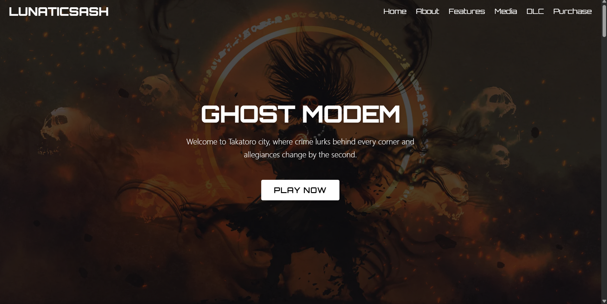
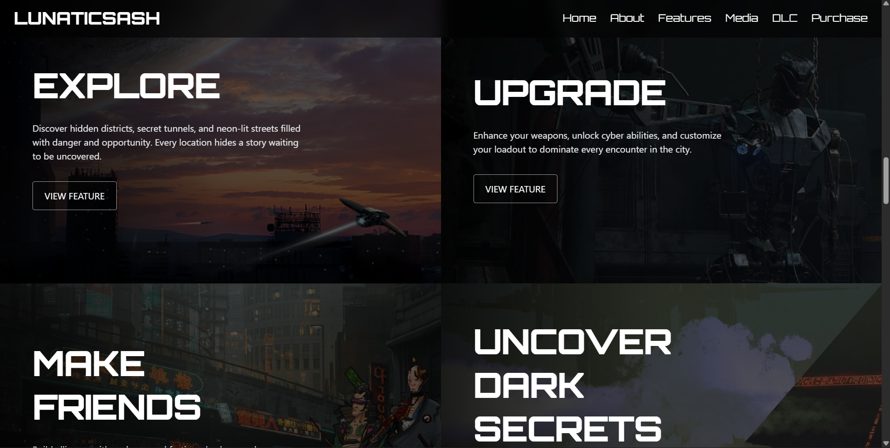
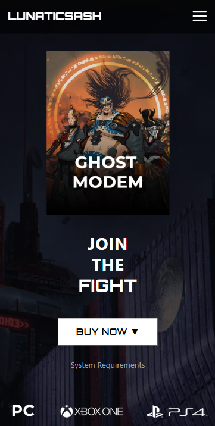

# 🎮 Lunaticsash Game Landing Page

A modern, responsive game landing page built using **React**, **Vite**, and **Tailwind CSS**.  
The project features smooth scrolling navigation, animated hero sections, interactive modals, and a clean gaming UI design.

---

## 🚀 Features

- ⚡ Fast build using Vite
- 🎨 Tailwind CSS responsive design
- 🧭 Smooth scroll navigation
- 🎞️ Animated hero slider
- 🛒 Interactive purchase section
- 💻 System requirements modal
- 📱 Fully mobile responsive
- 🌙 Modern gaming UI

---

## 🛠️ Tech Stack

- React
- Vite
- Tailwind CSS
- JavaScript

---
## 📸 Screenshots

### 🏠 Home


### 🎮 Media Gallery


### 🛒 Purchase Section


## 📦 Installation

```bash
git clone https://github.com/your-username/lunaticsash-game-landing.git
cd lunaticsash-game-landing
npm install
npm run dev


